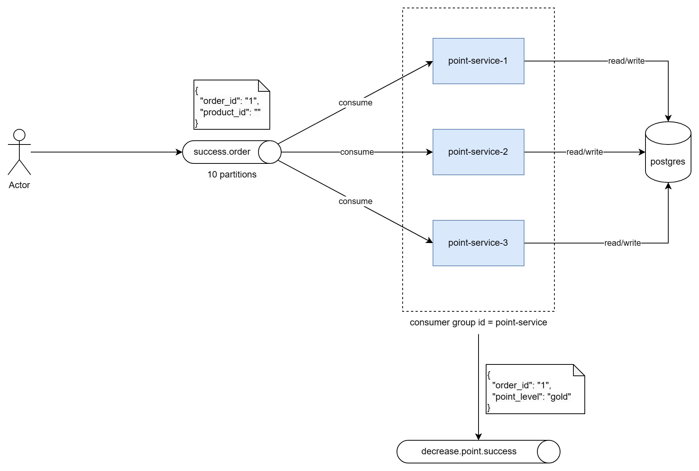

# Point Service

## Architecture


## Unit Test
You can run the tests using the following command:
```
go test ./... -cover
```

After running tests, you will see a coverage percentage, indicating the proportion of statements covered by the tests. In the example output:

```
ok      point-service/app/internal/service      0.295s  coverage: 81.5% of statements
```